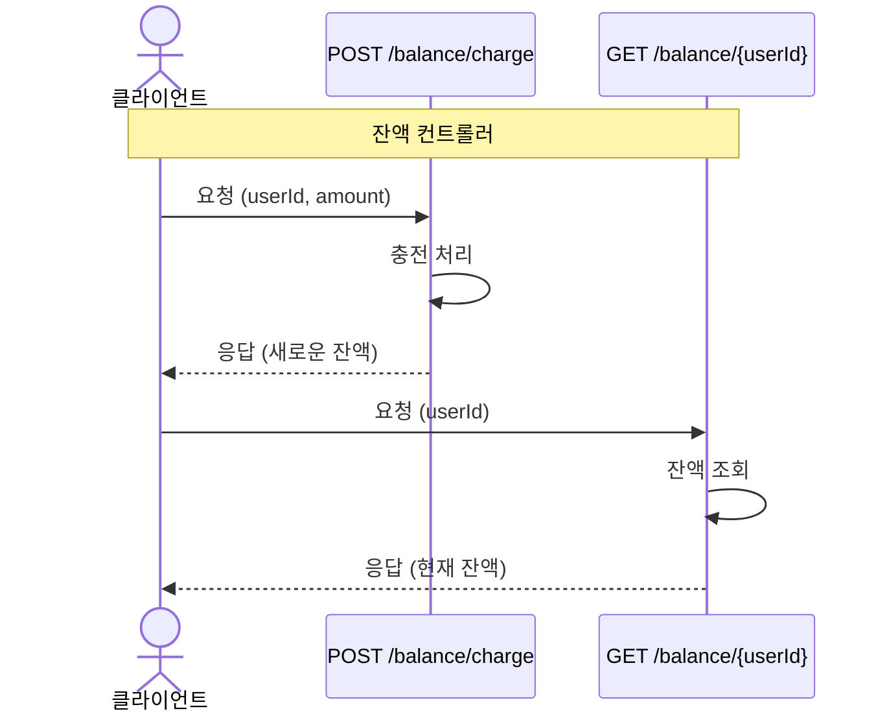
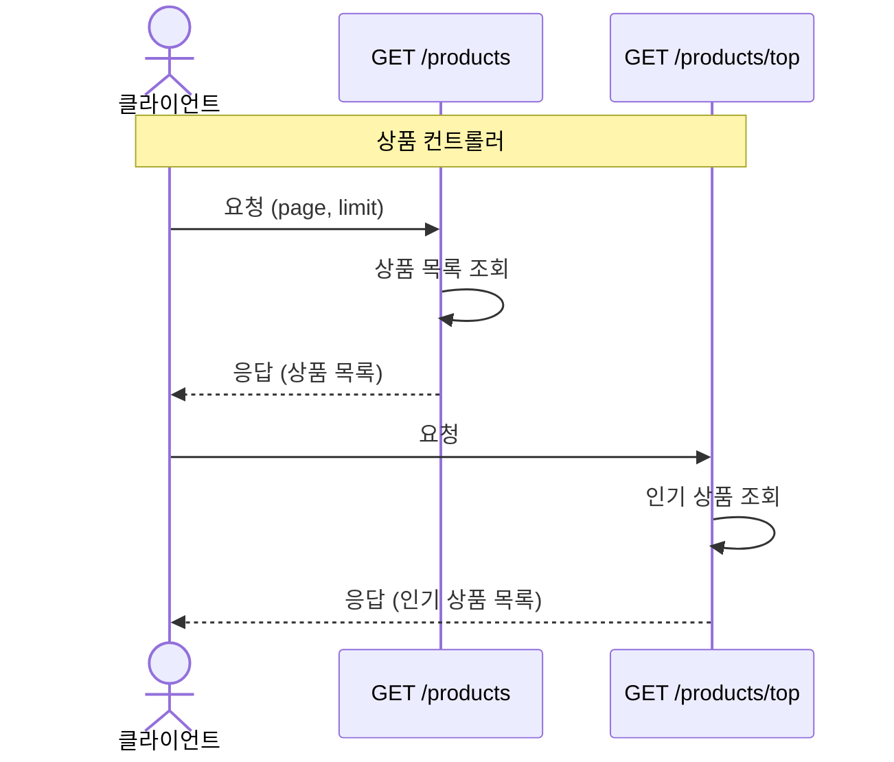
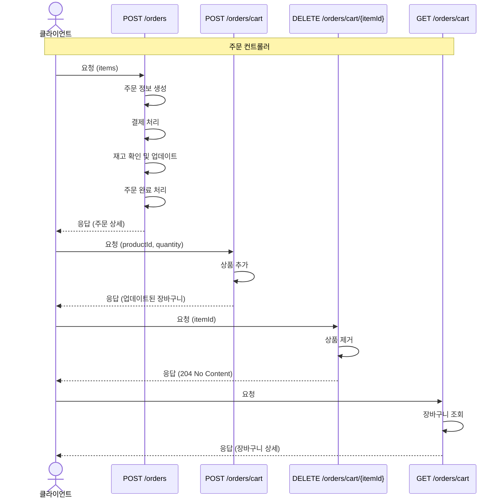

# 이커머스 서비스

- `e-커머스 상품 주문 서비스`를 구현해 봅니다.
- 상품 주문에 필요한 메뉴 정보들을 구성하고 조회가 가능해야 합니다.
- 사용자는 상품을 여러개 선택해 주문할 수 있고, 미리 충전한 잔액을 이용합니다.
- 상품 주문 내역을 통해 판매량이 가장 높은 상품을 추천합니다.

## 목차

- [요구사항](#요구사항)
- [잔액 충전 / 조회 API](#잔액-충전--조회-api)
  - [잔액 충전](#잔액-충전)
  - [잔액 조회](#잔액-조회)
- [상품 조회 API](#상품-조회-api)
  - [상품 조회](#상품-조회)
  - [인기 판매 상품 조회](#인기-판매-상품-조회)
- [주문 / 결제 API](#주문--결제-api)
  - [주문 및 결제](#주문-및-결제)
  - [장바구니](#장바구니)

### 요구사항

- 아래 4가지 API 를 구현합니다.
  - 잔액 충전 / 조회 API
  - 상품 조회 API
  - 주문 / 결제 API
  - 인기 판매 상품 조회 API
- 각 기능 및 제약사항에 대해 단위 테스트를 반드시 하나 이상 작성하도록 합니다.
- 다수의 인스턴스로 어플리케이션이 동작하더라도 기능에 문제가 없도록 작성하도록 합니다.
- 동시성 이슈를 고려하여 구현합니다.
- 재고 관리에 문제 없도록 구현합니다.

### 잔액 충전 / 조회 API

#### 잔액 충전

- 결제에 사용될 금액을 충전합니다.
- 사용자 식별자 및 충전할 금액을 받아 잔액을 충전합니다.

#### 잔액 조회

- 사용자 식별자를 통해 해당 사용자의 잔액을 조회합니다.

### 상품 조회 API

#### 상품 조회

- 상품 정보 ( ID, 이름, 가격, 잔여수량 ) 을 조회합니다.
- 조회시점의 상품별 잔여수량은 정확해야 합니다.

#### 인기 판매 상품 조회

- 최근 3일간 가장 많이 팔린 상위 5개 상품 정보를 제공합니다.
- 통계 정보를 다루기 위한 기술적 고민을 반영합니다.

### 주문 / 결제 API

#### 주문 및 결제

- 사용자 식별자와 (상품 ID, 수량) 목록을 입력받아 주문하고 결제를 수행합니다.
- 결제는 기 충전된 잔액을 기반으로 수행하며 성공할 시 잔액을 차감합니다.
- 데이터 분석을 위해 결제 성공 시에 실시간으로 주문 정보를 데이터 플랫폼에 전송해야 합니다.

#### 장바구니

- 사용자는 구매 이전에 관심 있는 상품들을 장바구니에 적재합니다.
- 장바구니 기능을 제공하기 위해 `장바구니 상품 추가/삭제`, `장바구니 조회`가 필요합니다.

