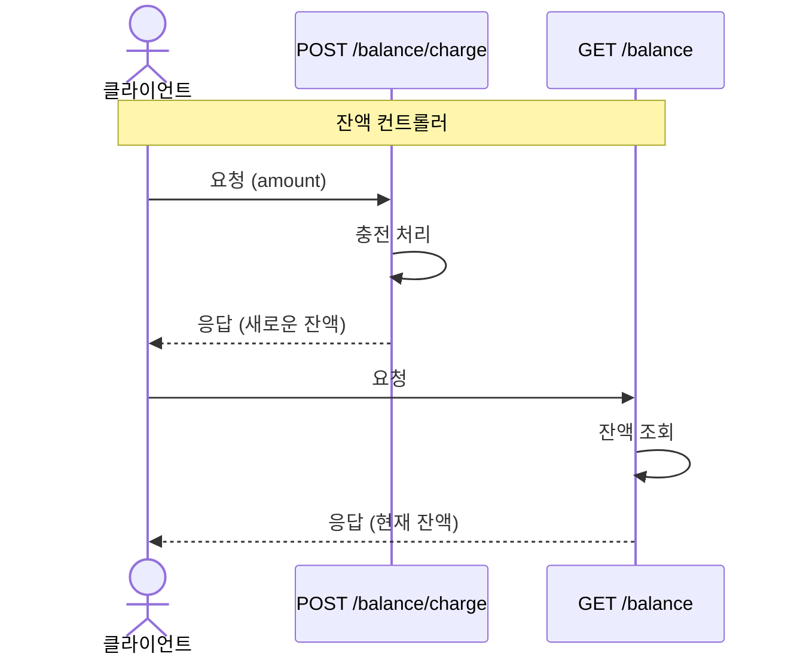

# 이커머스 서비스

- `e-커머스 상품 주문 서비스`를 구현해 봅니다.
- 상품 주문에 필요한 메뉴 정보들을 구성하고 조회가 가능해야 합니다.
- 사용자는 상품을 여러개 선택해 주문할 수 있고, 미리 충전한 잔액을 이용합니다.
- 상품 주문 내역을 통해 판매량이 가장 높은 상품을 추천합니다.

## 관련 문서

- [기본 패키지 구조 명세](/docs/structure.md)
- [API 명세](/docs/api-specification.md)
- [기술 스택 명세](/docs/tech-stacks.md)

## 목차

- [요구사항 분석](#요구사항-분석)
  - [요구사항](#요구사항)
  - [잔액 충전 / 조회 API](#잔액-충전--조회-api)
  - [상품 조회 API](#상품-조회-api)
  - [주문 / 결제 API](#주문--결제-api)

- [ERD](#erd)

### 요구사항 분석

#### 요구사항

- 아래 4가지 API 를 구현합니다.
  - 잔액 충전 / 조회 API
  - 상품 조회 API
  - 주문 / 결제 API
  - 인기 판매 상품 조회 API
- 각 기능 및 제약사항에 대해 단위 테스트를 반드시 하나 이상 작성하도록 합니다.
- 다수의 인스턴스로 어플리케이션이 동작하더라도 기능에 문제가 없도록 작성하도록 합니다.
- 동시성 이슈를 고려하여 구현합니다.
- 재고 관리에 문제 없도록 구현합니다.

#### 잔액 충전 / 조회 API

##### 잔액 충전

- 결제에 사용될 금액을 충전합니다.
- 사용자 토큰 및 충전할 금액을 받아 잔액을 충전합니다.
  - 동시성 제어를 위해 데이터베이스 트랜잭션과 비관적 락을 사용합니다. (추후 분산락 업데이트 예정)

##### 잔액 조회

- 사용자 토큰을 통해 해당 사용자의 잔액을 조회합니다.

#### 상품 조회 API

##### 상품 조회

- 상품 정보 ( ID, 이름, 가격, 잔여수량 ) 을 조회합니다.
- 조회시점의 상품별 잔여수량은 정확해야 합니다.
  - 성능 최적화를 위해 인덱스를 적절히 사용합니다.

##### 인기 판매 상품 조회

- 최근 3일간 가장 많이 팔린 상위 5개 상품 정보를 제공합니다.
- 통계 정보를 다루기 위한 기술적 고민을 반영합니다.
  - 매일 00시에 배치 작업을 실행하여 전날의 판매 데이터를 집계하고, 이를 별도의 '인기 상품' 테이블에 저장합니다.
  - '인기 상품' 테이블은 상품 ID, 판매량, 집계 일자 등의 정보를 포함합니다.
  - 집계 예시) 주문 테이블 같은 상품 id끼리 sum 연산 -> 수량순으로 정렬 -> 5개 추출

#### 주문 / 결제 API

##### 주문 및 결제

- 사용자 토큰과 (상품 ID, 수량) 목록을 입력받아 주문하고 결제를 수행합니다.
- 결제는 기 충전된 잔액을 기반으로 수행하며 성공할 시 잔액을 차감합니다.
- 데이터 분석을 위해 결제 성공 시에 실시간으로 주문 정보를 데이터 플랫폼에 전송해야 합니다.
  - 주문 처리 시 데이터베이스 트랜잭션을 사용하여 잔액 차감, 재고 업데이트, 주문 정보 저장을 원자적으로 처리합니다.
  - 재고 업데이트 시에는 비관적 락을 사용하여 동시성 문제를 해결합니다. (추후 분산락 업데이트 예정)
  - 데이터 플랫폼으로의 주문 정보 전송은 트랜잭션 완료 후 비동기적으로 처리하여 주문 처리 속도에 영향을 주지 않도록 합니다.

##### 장바구니

- 사용자는 구매 이전에 관심 있는 상품들을 장바구니에 적재합니다.
- 장바구니 기능을 제공하기 위해 `장바구니 상품 추가/삭제`, `장바구니 조회`가 필요합니다.
  - 장바구니 정보를 RDB에 저장합니다.
  - 사용자가 상품을 장바구니에 추가하려 할 때, 해당 상품의 현재 재고를 확인합니다.
  - 요청한 수량이 현재 재고보다 많으면, 장바구니 추가를 거부합니다.

### ERD

