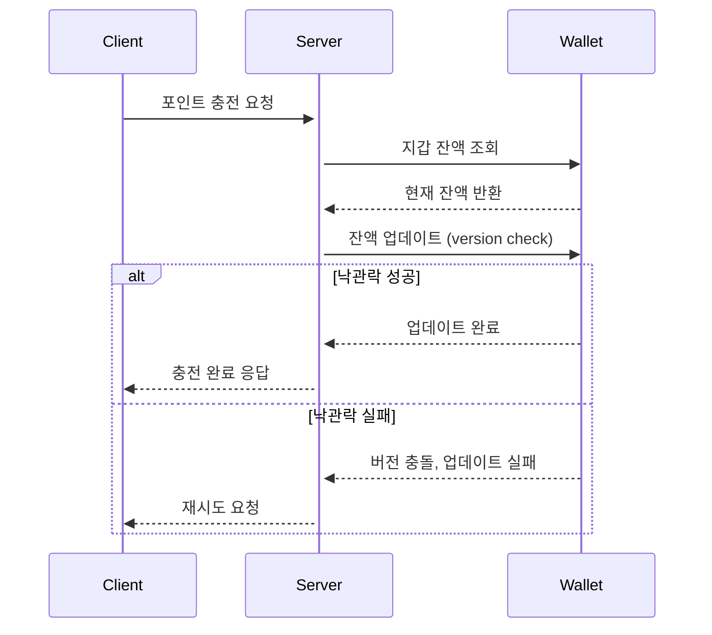
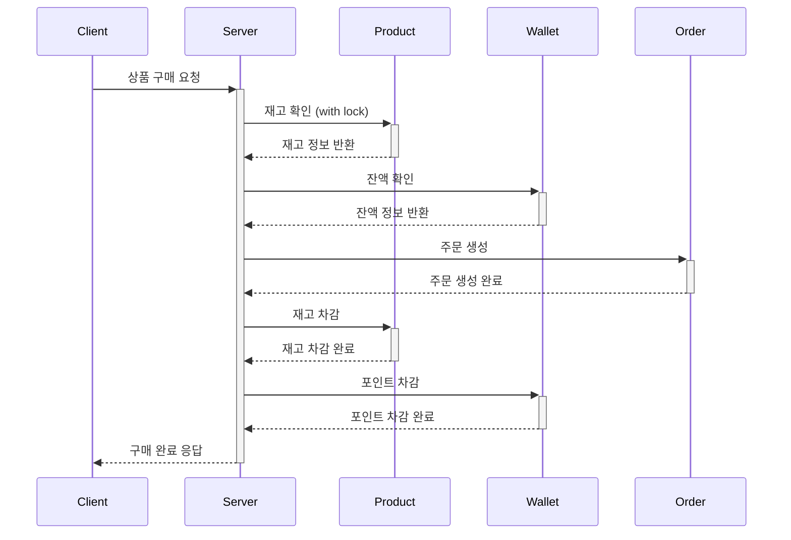

# 동시성 이슈 분석 및 제어 방식 검토

| 방식                     | 장점                                                                        | 단점                                                         |
| ------------------------ | --------------------------------------------------------------------------- | ------------------------------------------------------------ |
| Optimistic Lock          | 실제 충돌이 적을 때 성능이 우수<br>구현이 상대적으로 단순<br>DB 부하가 적음 | 충돌 시 재시도 로직 필요<br>높은 동시성 상황에서 재시도 증가 |
| Pessimistic Lock         | 데이터 정합성 보장이 확실<br>충돌이 많은 상황에서 효율적                    | DB 성능 저하 가능성<br>데드락 위험<br>확장성 제한            |
| Distributed Lock (Redis) | 분산 환경에서 효과적<br>DB 부하 감소<br>높은 확장성                         | 추가 인프라 필요<br>구현 복잡도 증가<br>Redis 장애 시 영향   |

## 1. 시나리오별 동시성 이슈 분석

### 1.1 포인트 충전 시나리오



**발생 가능한 이슈:**

- 동시에 여러 충전 요청으로 인한 Race Condition 발생
- 동시 트랜잭션 접근으로 인한 잔액 정합성 훼손

**낙관적 락 선택 이유:**

- 단일 사용자의 동시 접근 빈도가 낮음
- 충돌 시 재시도로 해결 가능
- DB 락 사용 최소화로 성능 확보

### 1.2 상품 구매 시나리오



**발생 가능한 이슈:**

- 동시 구매로 인한 재고 초과 판매
- 포인트 차감 시점의 잔액 부족
- 재고 확인과 차감 간 시차로 인한 정합성 문제

**비관적 락 선택 이유:**

- 다수 사용자의 동시 구매 요청 빈번
- 재고 데이터의 정확성 중요
- 롤백 비용 최소화 필요

## 2. 성능 테스트 결과

### 2.1 포인트 충전 (50 VU, 40 iterations)

#### 단일 유저 포인트 충전 부하 테스트 시나리오

[테스트 조건]

- 동시 요청: 50개
- 요청당 충전 횟수: 40회

[결과]

- 성공률: 11.6%
- 평균 응답시간: 66.02ms

<details>
<summary>테스트 결과 보기</summary>

</details>

### 2.2 상품 구매 (1000 VU, 1 iterations -> 1000개 요청 한꺼번에 보냄)

#### 상품 구매 부하 테스트 시나리오

[테스트 조건]

- 상품 재고: 100개
- 동시 요청: 1,000개
- 요청당 구매 수량: 1개

[기대 결과]

- 성공 요청: 100개 (재고만큼만 성공)
- 실패 요청: 900개 (재고 부족으로 실패)
- 실패율: 90% (900/1000)

[검증 포인트]

- 정확히 100개만 판매되어야 함 (초과 판매 없음)
- 재고 부족 시 적절한 에러 응답
- 동시성 제어가 정상 동작하는지 확인

#### Option 1. 처리율은 낮고 응답 속도가 빠름

```text
---- 트랜잭션 시작 ----
1. 주문 생성
2. 결제 처리 (with Optimistic Lock)
3. 주문 상태 업데이트
4. 재고 감소 (with Pessimistic Lock)
---- 트랜잭션 종료 ----
```

<details>
    <summary>테스트 결과 보기</summary>
    
</details>

#### Option 2. 처리율은 높고 응답 속도가 느림

```text
---- 트랜잭션 시작 ----
1. 주문 생성
2. 재고 감소 (with Pessimistic Lock)
3. 결제 처리 (with Optimistic Lock)
4. 주문 상태 업데이트
---- 트랜잭션 종료 ----
```

<details>
    <summary>테스트 결과 보기</summary>
    
</details>

#### 선택 - Option 2

Option 2를 선택한 이유:

1. 비즈니스적 관점

   - 재고 차감을 비관적 락으로 먼저 수행하여 구매 가능성 확보
     - 중요 자원(재고)을 먼저 확보하여 불필요한 결제 처리 방지
   - 고객 경험 및 신뢰도 향상

2. 기술적 관점

   - 재고는 동시 접근이 많아 충돌 가능성이 높음
   - 비관적 락으로 충돌 자체를 방지하여 롤백 비용 최소화
   - 처리율이 더 높아 전체적인 시스템 처리량 향상

3. 트레이드오프
   - 응답 시간이 다소 느려지는 단점 존재
   - 하지만 비즈니스 요구사항과 고객 경험을 고려했을 때 수용 가능한 수준

## 3. 결론

프로젝트 특성을 고려한 최종 설계:

1. 포인트 충전: 낙관적 락 적용

   - 단일 사용자 접근으로 충돌 가능성 낮음
   - 성능 우선 고려
   - 충돌 시 재시도로 해결 가능

2. 상품 구매: 비관적 락 적용

   - 재고는 동시 접근이 많아 충돌 가능성이 높음
   - 비관적 락으로 충돌 자체를 방지하여 롤백 비용 최소화
   - 처리율이 더 높아 전체적인 시스템 처리량 향상
