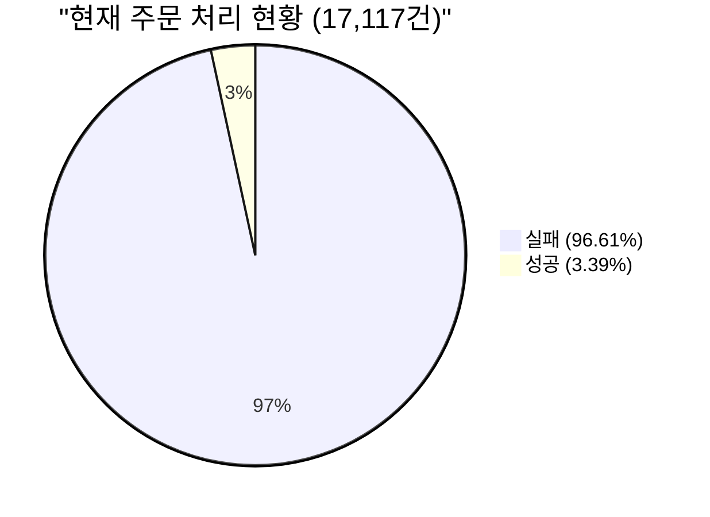
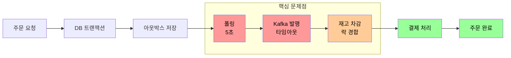
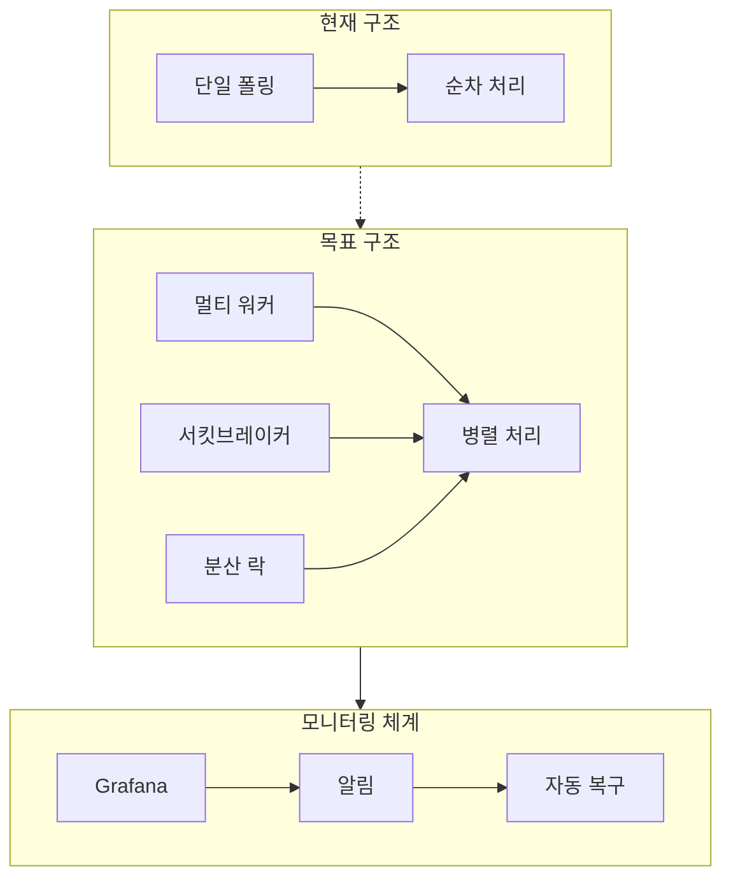
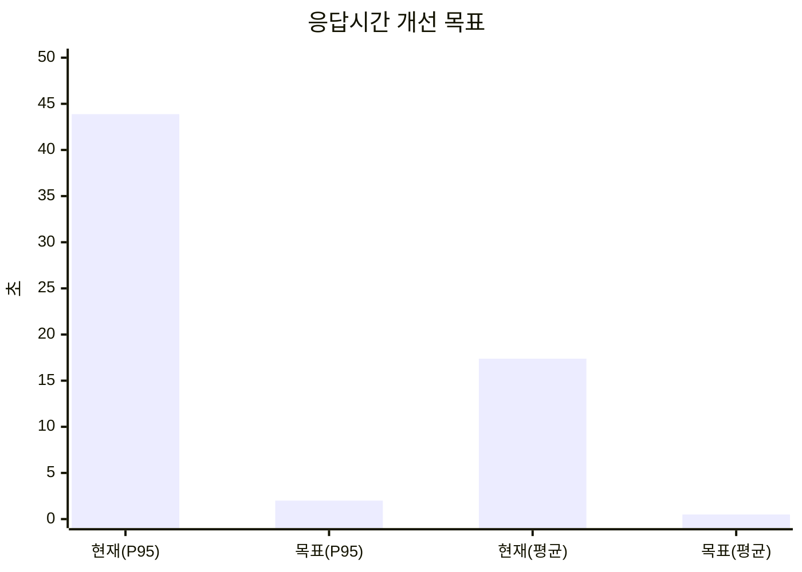

# 주문-결제 시스템 장애 대응 계획서: "1000 TPS를 향한 여정"

주문-결제 시스템은 큰 도전에 직면했습니다. 초당 1,000건의 주문을 3분간 처리하는 부하 테스트에서 실패한 것입니다. 97%에 달하는 실패율은 시스템의 개선이 시급함을 보여주었습니다.

### 병목 지점 분석

주문 플로우를 따라가며 발견한 핵심 병목 구간은 다음과 같습니다:

1. **아웃박스 이벤트 처리**
   현재 5초마다 단일 워커가 이벤트를 폴링하는 구조는 대규모 주문을 감당하기에 역부족했습니다. 폴링 간격이 길어 이벤트가 적체되고, 단일 워커로 인해 처리 속도가 제한되었습니다.

2. **카프카 메시지 발행**
   연결 타임아웃과 재시도 처리 부재로 인해 메시지 전달 신뢰성이 크게 저하되었습니다. 특히 순간적인 부하 증가 시 연쇄적인 장애가 발생했습니다.

3. **재고 차감 트랜잭션**
   낙관적 락 없이 진행된 재고 차감은 데드락과 경합 상황을 초래했고, 이는 전체 시스템의 응답 시간을 크게 지연시켰습니다.

### 개선 전략과 모니터링

다음과 같은 3단계 개선 전략을 수립했습니다:

**1단계: 즉시 적용 가능한 최적화**
- 아웃박스 폴링 주기를 1초로 단축
- 카프카 프로듀서 타임아웃 및 재시도 정책 수립
- 재고 테이블에 낙관적 락 도입

**2단계: 아키텍처 개선**
- 멀티 워커 기반 이벤트 처리 시스템 구축
- 서킷브레이커를 통한 장애 격리
- 분산 락을 활용한 정교한 동시성 제어

**3단계: 모니터링 고도화**
시스템 전반에 걸친 가시성 확보를 위해 Grafana 대시보드를 구축하고, 다음 지표들을 실시간으로 모니터링하겠습니다:
- 주문 성공률과 TPS
- 아웃박스 이벤트 처리 지연
- 카프카 컨슈머 LAG
- DB 트랜잭션 처리량

### 성능 목표

이러한 구조적 개선을 통해:
- 95% 이상의 주문 성공률
- p95 응답시간 2초 이내
- 안정적인 1000 TPS 처리

를 달성할 것으로 기대합니다. "실패는 예방하는 것이 아니라 관리하는 것"을 지향하며, 장애 상황에서도 빠르게 복구하고 학습할 수 있는 시스템을 만드는 것을 목표로 하겠습니다.