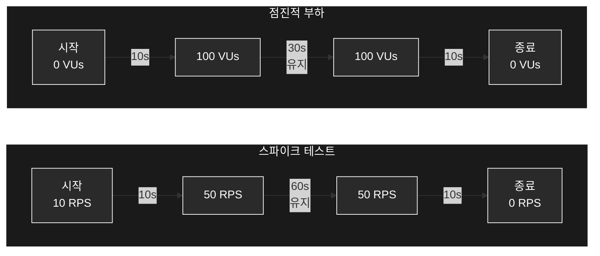

# 주문-결제 시스템 부하 테스트 계획서

"고객이 상품을 주문하고 결제하는 과정에서, 이커머스 서비스 시스템은 얼마나 많은 주문을 안정적으로 처리할 수 있을까?"

이 질문에 답하기 위해 부하 테스트를 계획했습니다. 시스템은 주문-재고-결제 트랜잭션이 분리된 MSA 구조로, 각 서비스는 아웃박스 패턴을 통해 메시지를 주고받습니다.

```mermaid
flowchart TB
   subgraph MarketSystem["주문 서비스"]
       direction TB
       T1[주문 트랜잭션 시작]
       T2[주문 생성]
       T3[아웃박스 이벤트 저장]
       T4[이벤트 발행]
       T5[커밋]

       T1 --> T2 --> T3 --> T4 --> T5
   end

   subgraph ProductSystem["재고 서비스"]
       direction TB
       P1[이벤트 수신]
       P2[재고 차감 트랜잭션]
       P3[재고 검증/차감]
       P4[아웃박스 이벤트 저장]
       P5[커밋]

       P1 --> P2 --> P3 --> P4 --> P5
   end

   subgraph UserSystem["결제 서비스"]
       direction TB
       U1[이벤트 수신]
       U2[결제 트랜잭션]
       U3[포인트 차감]
       U4[아웃박스 이벤트 저장]
       U5[커밋]

       U1 --> U2 --> U3 --> U4 --> U5
   end

   subgraph CompleteSystem["주문 완료"]
       direction TB
       C1[이벤트 수신]
       C2[상태 변경 트랜잭션]
       C3[주문 상태 갱신]
       C4[커밋]

       C1 --> C2 --> C3 --> C4
   end

   %% 서비스 연결
   T4 ==> P1
   P4 ==> U1
   U4 ==> C1

   classDef default fill:transparent,stroke:#fff,color:#fff
   classDef system fill:transparent,stroke:#fff,color:#fff,stroke-width:2px
   class MarketSystem,ProductSystem,UserSystem,CompleteSystem system
```

### 테스트가 필요한 이유

금요일 저녁 7시, 수많은 사용자가 동시에 인기 상품을 주문합니다. 이때 세 가지를 보장해야 합니다:

1. 재고는 정확하게 차감되어야 합니다
2. 결제는 한 번만 이루어져야 합니다
3. 주문 상태는 일관성을 유지해야 합니다.

### 구체적인 테스트 방법

#### 동시성 테스트 시나리오



#### 테스트 데이터 구성

- 재고: 3,000개의 상품
- 사용자: 50명의 동시 접속자
- 부하: 최대 200 VUs (Virtual Users)
- 목표: 초당 120건(120 RPS)의 트랜잭션 처리

#### 검증 포인트

- 재고 수량 정합성 (최종 재고 == 3,000개 - 성공주문수)
- 주문-재고차감-결제 간 일관성
- 응답시간 임계치 (95% < 2초)

### 테스트 결과

예상을 뛰어넘는 안정적인 성능을 확인했습니다:

- 처리량: 120 RPS 달성
- 안정성: 100% 성공률
- 응답성: 평균 90.71ms, 95% 이내 253.86ms
- 총 처리: 10,158건의 주문 완벽 처리


